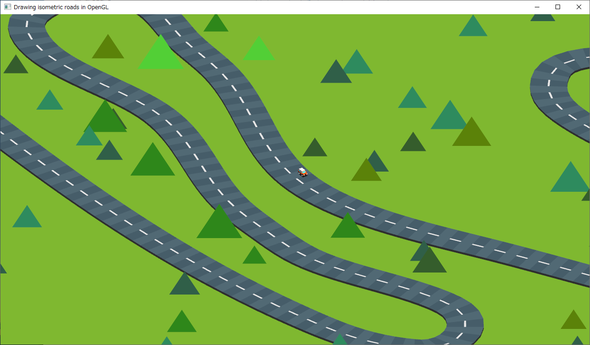
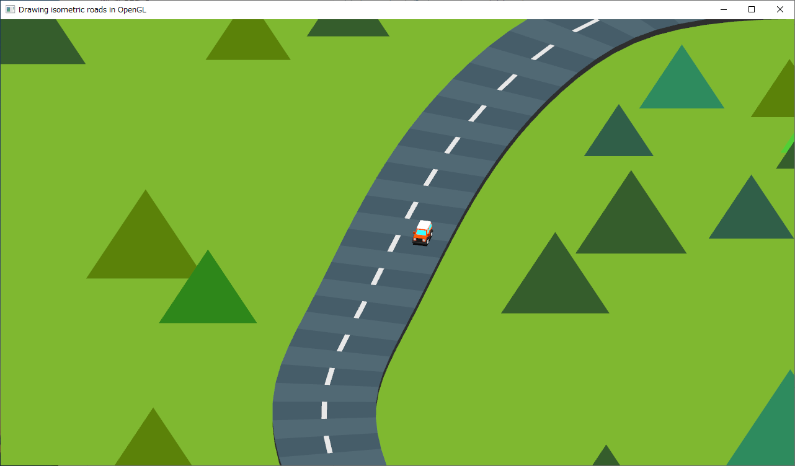

<!-- -*- encoding: utf-8 -*- -->

drawroadiso_py
==============

PythonとOpenGLを使ってアイソメトリックの見た目で道路を描画するデモスクリプト

Screenshots
-----------






Requirement / Environment / 動作確認環境
----------------------------------------

* Windows10 x64 22H2
* Python 3.10.10 64bit
* PyOpenGL 3.1.6 + PyOpenGL-accelerate 3.1.6
* glfw 2.7.0
* PyWavefront 1.3.3

Usage / 使い方
--------------

```
python draw_road_iso.py motosuko_roads.csv
or
python draw_road_iso.py housakatouge_roads.csv
```

License
-------

CC0 / Public Domain

Author
------

[mieki256](https://github.com/mieki256)

About the model data used / 使用モデルデータについて
----------------------------------------------------

* [Car Kit | OpenGameArt.org](https://opengameart.org/content/car-kit)

